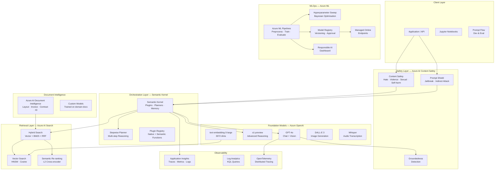
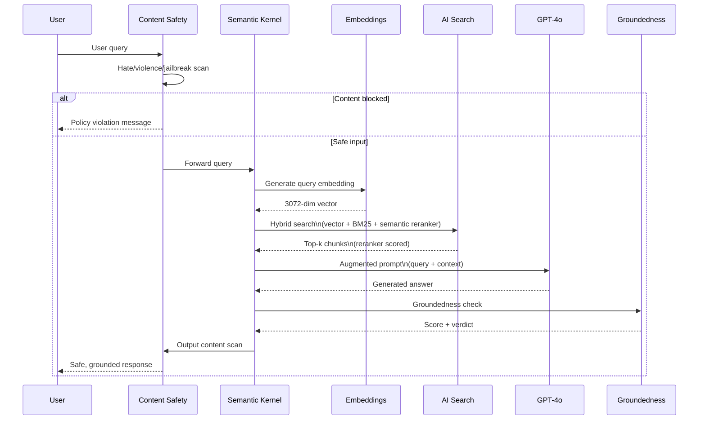
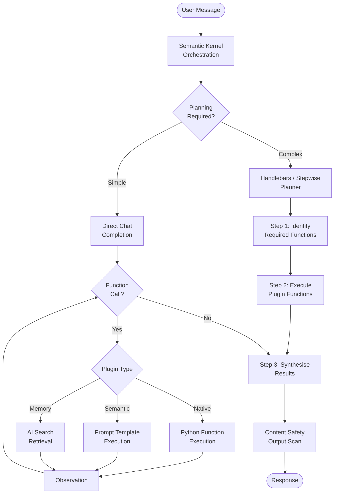
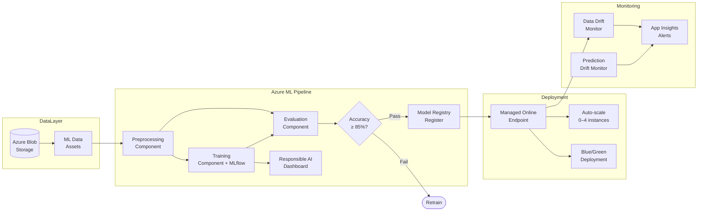
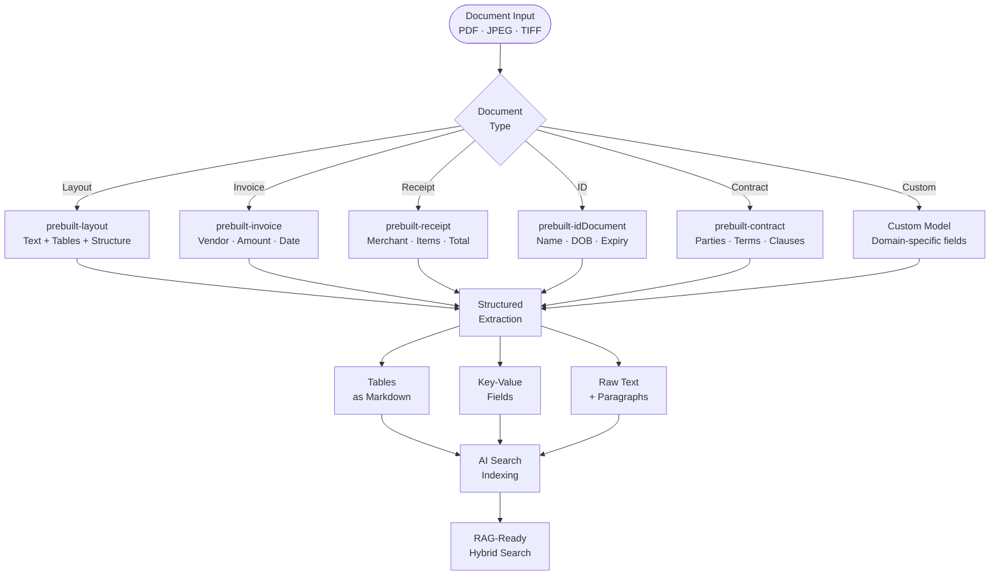
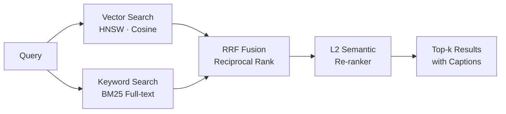

# Azure AI Platform Engineering


**Author:** Ramy Amer  
**Region:** australiaeast | **Python:** 3.12 | **Packaging:** pyproject.toml (Hatchling)

---

A production-grade reference implementation covering the full breadth of the Azure AI and machine learning platform. Every component is built to production standards — typed, tested, observable, wired through a single configuration file, and integrated with Azure Monitor. This is the architecture you deploy when AI reliability, safety, and cost control matter at enterprise scale.

---

## Table of Contents

- [Architecture Overview](#architecture-overview)
- [Components](#components)
  - [Azure OpenAI Service](#azure-openai-service)
  - [Azure AI Search — Hybrid RAG](#azure-ai-search--hybrid-rag)
  - [Semantic Kernel — Agent Orchestration](#semantic-kernel--agent-orchestration)
  - [Azure AI Content Safety](#azure-ai-content-safety)
  - [Azure AI Document Intelligence](#azure-ai-document-intelligence)
  - [Azure ML — MLOps Pipelines](#azure-ml--mlops-pipelines)
  - [Prompt Flow Evaluation](#prompt-flow-evaluation)
- [Project Structure](#project-structure)
- [Prerequisites](#prerequisites)
- [Deployment Guide](#deployment-guide)
- [Configuration Reference](#configuration-reference)
- [Cost Estimates](#cost-estimates)
- [Troubleshooting](#troubleshooting)

---

## Architecture Overview

### Full Platform Architecture



### Azure RAG Pipeline — Hybrid Search Flow



### Semantic Kernel Agent — Tool Execution



### Azure ML MLOps Pipeline



### Document Intelligence Pipeline



---

## Components

### Azure OpenAI Service

**Location:** `src/models/azure_openai_client.py`

Unified client across all Azure OpenAI deployments with streaming, vision, embeddings, image generation, audio transcription, and JSON mode.

**Supported deployments:**

| Config Key | Model | Best For |
|-----------|-------|---------|
| `gpt4o` | GPT-4o | Complex reasoning, vision, long context |
| `gpt4o_mini` | GPT-4o mini | Fast, cost-efficient tasks |
| `o1_preview` | o1-preview | Advanced multi-step reasoning |
| `o1_mini` | o1-mini | Faster reasoning tasks |
| `text_embed_3_large` | text-embedding-3-large | 3072-dim embeddings for RAG |
| `text_embed_3_small` | text-embedding-3-small | Efficient 1536-dim embeddings |
| `dall_e_3` | DALL-E 3 | Image generation |
| `whisper` | Whisper | Audio transcription |

**Usage:**
```python
from src.models.azure_openai_client import AzureOpenAIClient

client = AzureOpenAIClient(deployment_key="gpt4o")

# Chat
result = client.chat("Explain Azure AI Search hybrid retrieval.", system="You are an Azure expert.")
print(f"{result.content}\nCost: ${result.estimated_cost_usd:.4f}")

# Streaming
for chunk in client.chat_stream("Write a summary of Semantic Kernel"):
    print(chunk, end="", flush=True)

# Vision
result = client.chat_with_image("Describe this architecture diagram.", image_path=Path("arch.png"))

# JSON mode
data = client.json_mode("Extract the key fields from this invoice text: ...")

# Embeddings
emb = client.embed("Azure AI Search supports hybrid retrieval")
print(f"Dimensions: {emb.dimensions}")  # 3072
```

---

### Azure AI Search — Hybrid RAG

**Location:** `src/rag/ai_search_client.py`

Enterprise-grade hybrid search with vector (HNSW), BM25 keyword, RRF fusion, and L2 semantic re-ranking.



**Usage:**
```python
from src.rag.ai_search_client import AzureAISearchClient
from src.models.azure_openai_client import AzureOpenAIClient

aoai = AzureOpenAIClient()
search = AzureAISearchClient()

query = "What is the data residency requirement for PII?"
embedding = aoai.embed(query).embedding

# Hybrid search with semantic re-ranking
results = search.hybrid_search(query=query, embedding=embedding, top_k=10)

for r in results:
    print(f"[{r.reranker_score:.3f}] {r.title}: {r.content[:120]}")

# Index documents
search.upsert_documents([{
    "id": "policy-01",
    "content": "All PII must remain in Australia East...",
    "title": "Data Residency Policy",
    "source": "policy-v2.pdf",
    "content_vector": aoai.embed("All PII must remain in Australia East...").embedding,
}])
```

---

### Semantic Kernel — Agent Orchestration

**Location:** `src/agents/semantic_kernel_agent.py`

Multi-step AI agent with Azure OpenAI backend, plugin registry, Handlebars/Stepwise planners, and persistent chat history.

**Usage:**
```python
from src.agents.semantic_kernel_agent import SemanticKernelAgent
from semantic_kernel.functions import kernel_function

agent = SemanticKernelAgent()

# Register a custom native function
@kernel_function(name="get_exchange_rate", description="Get current AUD/USD exchange rate")
async def get_rate(currency_pair: str) -> str:
    return f"{currency_pair}: 0.6512"

agent.register_native_function("Finance", get_rate)

# Chat with automatic function calling
response = await agent.chat(
    "What is the AUD/USD rate and what time is it in Sydney right now?"
)
print(response.content)

# Multi-step planning
plan_result = await agent.create_plan(
    "Research the top 3 Azure AI services and create a comparison summary",
    planner_type="handlebars",
)
print(plan_result)
```

---

### Azure AI Content Safety

**Location:** `src/safety/content_safety_client.py`

Comprehensive content moderation: hate/violence/sexual/self-harm analysis, Prompt Shield for jailbreaks and indirect injection, and RAG groundedness verification.

**Usage:**
```python
from src.safety.content_safety_client import AzureContentSafetyClient

cs = AzureContentSafetyClient()

# Scan user input
result = cs.scan_input(user_message)
if not result.is_safe:
    return f"Blocked: {result.categories_triggered()}"

# Shield against prompt injection in retrieved documents
shield = cs.shield_prompt(user_message, documents=retrieved_doc_texts)
if shield.document_attack:
    return "Retrieved document contains a potential injection attack."

# Verify RAG answer is grounded
ground = cs.check_groundedness(
    query="What is the refund policy?",
    answer=rag_answer,
    sources=[chunk.content for chunk in chunks],
)
if not ground.is_grounded:
    return "Answer could not be verified against source documents."
```

---

### Azure AI Document Intelligence

**Location:** `src/document_intelligence/document_intelligence_client.py`

Layout, invoice, receipt, ID, contract, and custom model analysis with structured field extraction and table parsing.

**Usage:**
```python
from pathlib import Path
from src.document_intelligence.document_intelligence_client import AzureDocumentIntelligenceClient

doc = AzureDocumentIntelligenceClient()

# Invoice extraction
result = doc.analyze_invoice(Path("invoice.pdf"))
print(f"Vendor: {result.get_field('VendorName')}")
print(f"Total:  {result.get_field('InvoiceTotal')}")
print(f"Due:    {result.get_field('DueDate')}")
print(result.tables_as_markdown())

# Layout analysis
layout = doc.analyze_layout(Path("contract.pdf"), output_format="markdown")
print(layout.raw_text)
```

---

### Azure ML — MLOps Pipelines

**Location:** `src/pipelines/azure_ml_pipeline.py`

End-to-end Azure ML pipelines with preprocessing, training, Responsible AI dashboard, model registry, hyperparameter sweep, and managed online endpoint deployment.

**Usage:**
```python
from src.pipelines.azure_ml_pipeline import AzureMLOrchestrator

ml = AzureMLOrchestrator()

# Submit training pipeline
result = ml.submit_training_pipeline(
    experiment_name="churn-prediction-v2",
    training_data="azureml:churn-data:3",
    compute_cluster="gpu-cluster",
)

# Wait for completion
final = ml.wait_for_job(result.job_name)
if final.succeeded:
    endpoint = ml.deploy_model("churn-model", model_version="5")
    print(f"Scoring URI: {endpoint.scoring_uri}")

# Hyperparameter sweep
sweep_job = ml.run_sweep_job(
    experiment_name="churn-hpo",
    training_data="azureml:churn-data:3",
    max_total_trials=20,
    max_concurrent_trials=4,
)
```

---

### Prompt Flow Evaluation

**Location:** `src/evaluation/prompt_flow_evaluator.py`

LLM-as-judge evaluation using Azure AI Studio metric definitions: groundedness (1–5), relevance (1–5), coherence (1–5), fluency (1–5), semantic similarity, and F1 score.

**Usage:**
```python
from src.evaluation.prompt_flow_evaluator import PromptFlowEvaluator

evaluator = PromptFlowEvaluator()

result = evaluator.evaluate_rag_response(
    question="What is the maximum upload size?",
    answer=rag_response,
    context="\n".join(r.content for r in search_results),
    ground_truth="The maximum upload size is 100MB per Section 3.2.",
)

print(f"Groundedness: {result.groundedness}/5")
print(f"Relevance:    {result.relevance}/5")
print(f"Coherence:    {result.coherence}/5")
print(f"Fluency:      {result.fluency}/5")
print(f"Overall:      {result.overall_score:.1f}/5")

# Batch evaluation with App Insights publishing
summary = evaluator.evaluate_batch(test_cases, publish_to_appinsights=True)
print(f"Pass rate: {summary.pass_rate:.1%}")
```

---

## Project Structure

```
azure-ai-platform-engineering/
├── config/
│   └── azure_config.yaml               # ← Wire all Azure resources here
│
├── src/
│   ├── models/
│   │   └── azure_openai_client.py      # Chat, streaming, vision, embeddings, DALL-E, Whisper
│   ├── agents/
│   │   └── semantic_kernel_agent.py    # SK agent, plugins, planners, chat history
│   ├── rag/
│   │   └── ai_search_client.py         # Hybrid search, vector, BM25, reranking, indexing
│   ├── safety/
│   │   └── content_safety_client.py    # Content analysis, Prompt Shield, groundedness
│   ├── pipelines/
│   │   └── azure_ml_pipeline.py        # Azure ML pipelines, sweep, registry, endpoints
│   ├── document_intelligence/
│   │   └── document_intelligence_client.py  # Layout, invoice, contract, custom models
│   ├── evaluation/
│   │   └── prompt_flow_evaluator.py    # LLM-as-judge, 5 metrics, batch eval, App Insights
│   └── utils/
│       ├── config.py                   # Config loader with env var substitution
│       └── logging.py                  # Structured logging + App Insights integration
│
├── notebooks/
│   ├── 01_azure_openai_chat_and_vision.ipynb
│   ├── 02_hybrid_rag_with_ai_search.ipynb
│   ├── 03_semantic_kernel_agents.ipynb
│   ├── 04_content_safety_and_prompt_shield.ipynb
│   ├── 05_document_intelligence.ipynb
│   ├── 06_azure_ml_pipeline.ipynb
│   └── 07_prompt_flow_evaluation.ipynb
│
├── tests/
│   ├── unit/
│   │   ├── test_azure_openai_client.py
│   │   └── test_ai_search_client.py
│   └── integration/
│
├── infrastructure/
│   ├── bicep/                          # Azure Bicep IaC templates
│   └── terraform/                      # Terraform alternative
│
├── scripts/
│   ├── preprocess.py                   # Azure ML preprocessing
│   ├── train.py                        # Azure ML training with MLflow
│   └── evaluate.py                     # Azure ML evaluation + RAI
│
├── docs/
│   └── architecture.md
│
├── pyproject.toml
├── .gitignore
└── LICENSE
```

---

## Prerequisites

### Azure Resources Required

| Resource | SKU / Tier | Purpose |
|----------|-----------|---------|
| Azure OpenAI | Standard S0 | GPT-4o, embeddings, DALL-E 3, Whisper |
| Azure AI Search | Standard S1 | Vector + hybrid search with semantic re-ranking |
| Azure AI Content Safety | Standard S0 | Content moderation, Prompt Shield |
| Azure AI Document Intelligence | Standard S0 | Document extraction |
| Azure ML Workspace | Standard | Pipelines, model registry, endpoints |
| Application Insights | Standard | Telemetry and metrics |
| Azure Key Vault | Standard | Secrets management |
| Azure Blob Storage | LRS | Data assets and model artifacts |

### Required RBAC Roles

Assign these roles to your service principal or managed identity:

```bash
# Cognitive Services OpenAI User
az role assignment create --role "Cognitive Services OpenAI User" \
  --assignee <principal-id> --scope /subscriptions/<sub>/resourceGroups/<rg>

# Search Index Data Contributor
az role assignment create --role "Search Index Data Contributor" \
  --assignee <principal-id> --scope /subscriptions/<sub>/resourceGroups/<rg>

# AzureML Data Scientist
az role assignment create --role "AzureML Data Scientist" \
  --assignee <principal-id> --scope /subscriptions/<sub>/resourceGroups/<rg>

# Storage Blob Data Contributor
az role assignment create --role "Storage Blob Data Contributor" \
  --assignee <principal-id> --scope /subscriptions/<sub>/resourceGroups/<rg>
```

---

## Deployment Guide

### Step 1 — Clone and Install

```bash
git clone https://github.com/romeosd/azure-ai-platform-engineering.git
cd azure-ai-platform-engineering

python3.12 -m venv .venv
source .venv/bin/activate

pip install -e ".[dev,notebooks]"
```

### Step 2 — Authenticate to Azure

```bash
# Option A — Azure CLI (local dev)
az login
az account set --subscription <your-subscription-id>

# Option B — Service Principal
export AZURE_CLIENT_ID=<app-id>
export AZURE_CLIENT_SECRET=<secret>
export AZURE_TENANT_ID=<tenant-id>
export AZURE_SUBSCRIPTION_ID=<subscription-id>

# Option C — Managed Identity (on Azure VMs/ACI/AKS)
# No credentials needed — DefaultAzureCredential handles it automatically
```

### Step 3 — Configure azure_config.yaml

Export the required environment variables:

```bash
export AZURE_SUBSCRIPTION_ID=<your-sub-id>
export AZURE_RESOURCE_GROUP=<your-rg>
export AZURE_TENANT_ID=<your-tenant-id>
export AZURE_OPENAI_ENDPOINT=https://<your-aoai-name>.openai.azure.com/
export AZURE_OPENAI_API_KEY=<your-key>
export AZURE_SEARCH_ENDPOINT=https://<your-search-name>.search.windows.net
export AZURE_SEARCH_API_KEY=<your-key>
export CONTENT_SAFETY_ENDPOINT=https://<your-cs-name>.cognitiveservices.azure.com/
export CONTENT_SAFETY_API_KEY=<your-key>
export DOCUMENT_INTELLIGENCE_ENDPOINT=https://<your-di-name>.cognitiveservices.azure.com/
export DOCUMENT_INTELLIGENCE_API_KEY=<your-key>
export AML_WORKSPACE_NAME=<your-aml-workspace>
export APPLICATIONINSIGHTS_CONNECTION_STRING=<your-appinsights-connection-string>
```

### Step 4 — Provision Azure OpenAI Deployments

```bash
# Via Azure CLI
az cognitiveservices account deployment create \
  --resource-group <rg> \
  --name <aoai-name> \
  --deployment-name gpt-4o \
  --model-name gpt-4o \
  --model-version "2024-11-20" \
  --model-format OpenAI \
  --sku-capacity 80 \
  --sku-name "Standard"
```

### Step 5 — Create Azure AI Search Index

```python
from src.rag.ai_search_client import AzureAISearchClient

search = AzureAISearchClient()
index = search.create_index(
    index_name="azure-ai-platform-documents",
    vector_dimensions=3072,  # text-embedding-3-large
)
print(f"Index created: {index.name}")
```

### Step 6 — Run Tests

```bash
# Unit tests (no Azure connection required)
pytest tests/unit/ -v

# With coverage
pytest --cov=src --cov-report=html
open htmlcov/index.html
```

### Step 7 — Deploy Infrastructure (Optional)

```bash
# Using Azure Bicep
cd infrastructure/bicep
az deployment group create \
  --resource-group <rg> \
  --template-file main.bicep \
  --parameters location=australiaeast

# Using Terraform
cd infrastructure/terraform
terraform init
terraform plan -var="resource_group=<rg>" -var="location=australiaeast"
terraform apply
```

---

## Configuration Reference

| Section | Key | Description |
|---------|-----|-------------|
| `azure_openai.endpoint` | — | Your Azure OpenAI resource endpoint URL |
| `azure_openai.deployments` | `gpt4o` | Deployment name for GPT-4o |
| `azure_openai.inference` | `temperature` | Default sampling temperature (0.1) |
| `ai_search.endpoint` | — | Your AI Search service endpoint URL |
| `ai_search.retrieval` | `query_type` | semantic / hybrid / simple |
| `ai_search.vector` | `dimensions` | Embedding dimensions (3072 for text-3-large) |
| `content_safety.thresholds` | `hate` | Severity threshold 0/2/4/6 |
| `azure_ml.compute` | `training_cluster` | Compute cluster name |
| `observability.application_insights` | `connection_string` | App Insights connection string |

---

## Cost Estimates

Approximate costs for `australiaeast` region (USD).

| Component | Workload | Estimated Cost |
|-----------|---------|---------------|
| GPT-4o | 1M input + 200K output tokens/day | ~$4.50/day |
| GPT-4o mini | 5M input + 1M output tokens/day | ~$1.10/day |
| text-embedding-3-large | 10M tokens/month | ~$1.30/month |
| AI Search Standard S1 | 1 replica · 1 partition | ~$250/month |
| AI Search Semantic | Per query (1M/month) | ~$3/month |
| Content Safety | 1M text analyses/month | ~$1.50/month |
| Document Intelligence | 1K pages/month | ~$1.50/month |
| Azure ML compute | Standard_DS3_v2 · 8hr training | ~$0.95/run |
| Managed Online Endpoint | Standard_DS3_v2 · 24/7 | ~$110/month |

> **Cost control tip:** Azure ML compute clusters scale to zero when idle. Azure OpenAI has no idle cost — pay only for tokens processed.

---

## Troubleshooting

### AuthenticationError — Azure OpenAI

```
openai.AuthenticationError: Error code: 401
```
Check: 1) `AZURE_OPENAI_API_KEY` is set, 2) The deployment name in config matches exactly what was created in Azure, 3) The `api_version` is current.

### AI Search: 403 Forbidden

Ensure your API key has **Search Index Data Contributor** role. For managed identity, add the role assignment via Azure Portal → AI Search → Access Control (IAM).

### Content Safety: Model not found

Content Safety models are region-specific. Ensure your `CONTENT_SAFETY_ENDPOINT` is in `australiaeast` and the API version matches `2024-09-01`.

### Azure ML: ComputeNotFound

Create the compute cluster first:
```python
ml = AzureMLOrchestrator()
ml.create_compute_cluster("cpu-cluster", vm_size="Standard_DS3_v2", max_instances=4)
```

### Semantic Kernel: Plugin function not invoked

Ensure the `@kernel_function` decorator includes a clear `description` — the planner uses this to decide when to call the function. Vague descriptions lead to the function being skipped.

---

## Architecture Decisions

See [`docs/architecture.md`](docs/architecture.md) for decisions covering:

- Why Azure AI Search over Qdrant/Pinecone for enterprise RAG
- Semantic re-ranker vs pure vector similarity
- Semantic Kernel vs LangChain for Azure-native orchestration
- Content Safety placement (input AND output, not just one)
- Azure ML vs Databricks for MLOps in regulated industries

---

*Built by Ramy Amer — Azure AI Platform Engineering | australiaeast*
